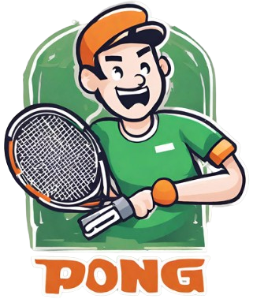
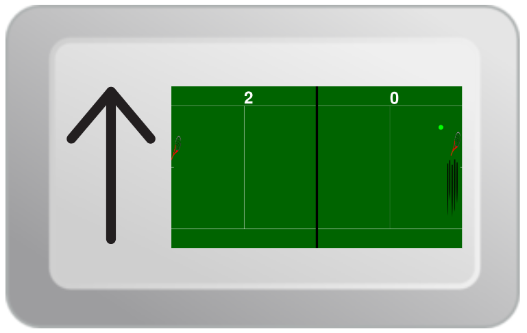
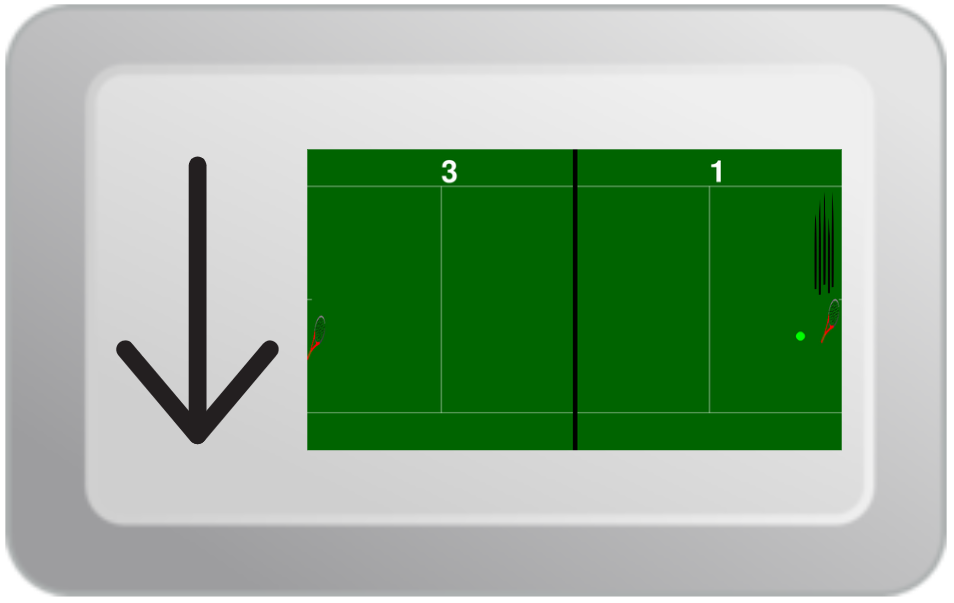
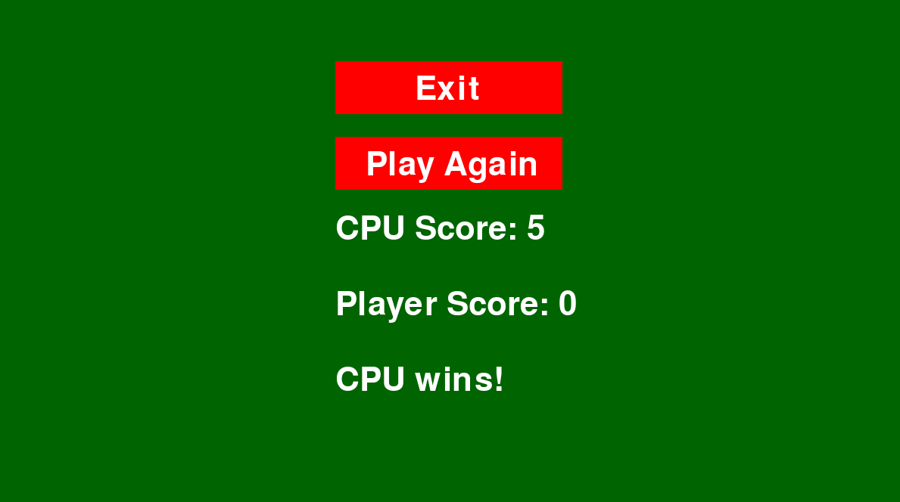

# Tennis Pong

## Game Overview
This super addicting game puts a spin on the classic game Pong. Do you like tennis? Do you like nostalgic Atari games? You're in the right place! Our game provides the same functionality as the original Pong along with graphics representing a tennis match. For new players, the objective of the game is to block the moving ball from hitting your baseline while trying to get the ball to hit your opponent's baseline indicating a point score. We've developed a one-player game with the opponent being a CPU and the game ends when either the player or CPU reaches a score of 5.

## Instructions to Start Playing
In order to run the code for our game and start playing, take the following steps:
1. Navigate to the GitHub repository linked [here](https://github.com/olincollege/tennis_pong).
2. Clone the repository to create a copy of it onto your local machine.
3. Follow the directions in `README.md` linked [here](https://github.com/olincollege/tennis_pong/blob/main/README.md).
4. Start playing!

## How to Play
As mentioned before, the goal of the game is to block the moving ball from hitting your baseline while trying to get the ball to hit the CPU's baseline. Users should move their racket up and down along the baseline to block and hit the ball back. They should use the up and down arrow keys to move the racket.

<i>Player moving up to hit the ball</i> 

<i>Player moving down to hit the ball</i> 

The ball slowly gets faster with each collision, thus making the game more difficult as it goes on both for the player and CPU. Once the player or CPU reaches a score of 5, the player can decide whether to play again or quit.

<i>End screen, hopefully this isn't your score!</i> 

## Video Presentation
The following video presentation provides an overview of our game, its software architecture, insights we learned throughout its completiong, as well as next steps we would take to iterate upon it.

    <video controls style="max-width: 50%;">
        <source src="visuals/Tennis Pong - Ishan, Cian, Ahan.mp4" type="video/mp4">
    </video>

## About the Creators
Hello! We are three freshmen from the Olin College of Engineering: Ishan P, Ahan T, and Cian L. We are happy to present Tennis Pong for your entertainment!